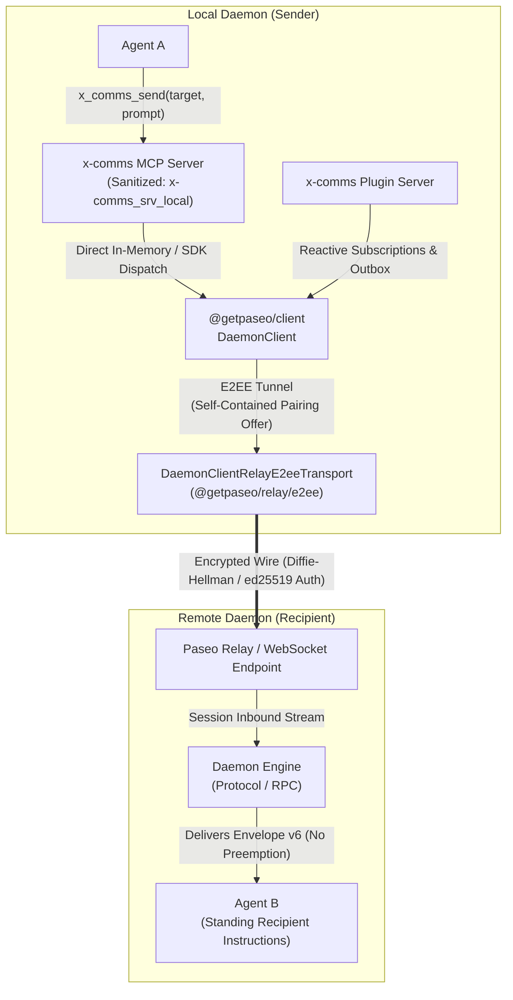
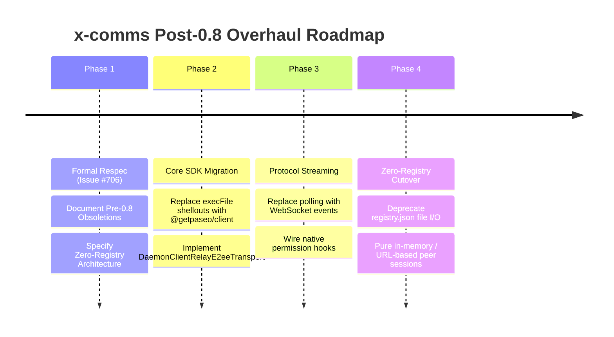

# x-comms Evolution Contract: Pre-0.8 Obsoletions & Post-0.8/0.10 Architecture

**Status:** Target Features Specification  
**Authority:** Paseo >= 0.9.0 / 0.10.x Protocol & `@getpaseo/client`  
**Tracking Issue:** [#706 (priority/0-SOS)](https://forge.mrs.uppidi.com/xpufx-org/paseo/issues/706)  
**Operator Directive:** *"no registry dependency. QUICK!"*  
**Companion Documents:** [`contract-plugin.md`](contract-plugin.md) · [`contract-mcp.md`](contract-mcp.md) · [`contract-drift.md`](contract-drift.md) · [`mesh.md`](mesh.md)

---

## 1. Executive Summary & The Zero-Registry Mandate

The initial pre-0.8 implementation of `x-comms` served as a functional bridge for cross-daemon agent interactions. However, it was built around constraints of early Paseo releases:
1. Shelling out to the `paseo` CLI binary (`execFile("paseo", [...])`) for messaging and status checks.
2. Relying on a centralized/local registry file (`~/.paseo/plugin-data/xpufx/paseo-x-comms/registry.json`) or environment table (`PASEO_X_COMMS_REMOTES`) to resolve daemon aliases to static addresses.
3. Polling daemon and agent state via repeated CLI probes.
4. Using dotted MCP server naming conventions (`x-comms.<serverId>`) that broke MCP clients.

With Paseo 0.8/0.10 and the `@getpaseo/client` SDK, these patterns are entirely obsolete. Modern Paseo provides:
* First-class end-to-end encrypted (E2EE) relay channels via `@getpaseo/relay/e2ee` and `DaemonClientRelayE2eeTransport`.
* Push-based reactive WebSocket event streams for turns, timelines, and permissions.
* Strict ACP-compliant sanitized server identifiers (`x-comms_<serverId>`).
* Native daemon-level schedule and heartbeat engines.
* Native protocol hooks for permissions and attention routing.

### The Zero-Registry Mandate

Under operator directive for issue #706 (*"no registry dependency. QUICK!"*), **`x-comms` eliminates all dependency on static registry tables (`registry.json`, `hosts.json`, or shared database registries).**

#### The Flaws of the Registry Model:
* **Coordination Tax & Fragility:** Requiring out-of-band updates to a local `registry.json` or shared filesystem table introduces stale endpoints, race conditions on disk writes, and synchronization lag across fleets.
* **Security & Credential Sprawl:** Storing sensitive pairing offers (which contain Diffie-Hellman keys, tokens, and relay endpoints) in plaintext JSON files on disk creates credential leak risks.
* **Static vs Dynamic Mesh:** Agents in containerized, ephemeral, or autoscaled environments change locations dynamically; static registry files cannot track ephemeral daemon lifecycles without complex external daemons or file watchers.

#### The Zero-Registry Architecture:
1. **Self-Contained Pairing Offers & Direct URLs:**
   Daemons pair point-to-point using self-contained pairing URLs (`https://app.paseo.sh/#offer=<b64>` or custom relay URLs) or direct addresses (`ws://<host>:<port>`, `unix://<path>`). A pairing offer encapsulates the relay endpoint, public encryption key, authentication token, and claimed daemon `serverId`. No external lookup table is queried.
2. **On-Demand & Session-Bound Direct Transports:**
   When an agent or client addresses a peer daemon, it supplies the direct pairing URL or active peer session handle. The connection is established directly using `DaemonClientRelayE2eeTransport` or WebSocket transport.
3. **Dynamic Push Discovery Over Authenticated Links:**
   Once an E2EE relay channel is established, peer agents and workspaces are discovered dynamically by querying the peer's live daemon protocol (`DaemonClient.observeAgents()`, `DaemonClient.fetchAgents()`, or session event subscriptions). Discovery is live, push-driven, and scoped to authenticated channels—not read from a static list of names in a file.
4. **Deprecation of File-Backed Registry Tools:**
   `x_comms_add_daemon`, `x_comms_remove_daemon`, and `x_comms_list_daemons` are migrated from mutating `registry.json` on disk to managing live peer sessions and in-memory connection pools keyed by verified `serverId`.

---

## 2. Pre-0.8 Obsolete Patterns: Deprecation & Replacement Ledger

The following pre-0.8 patterns are formally declared **OBSOLETE**. They are cataloged below with the architectural justification for their removal and their exact post-0.8/0.10 replacements.

| # | Obsolete Pre-0.8 Pattern | Architectural Defect / Limitation | Post-0.8 / 0.10 Modern Replacement | Affected Surfaces |
|---|---|---|---|---|
| **OBS-1** | **CLI Shell-Outs for Messaging (`paseo send`)** | Relied on child process execution `execFile("paseo", ["send", ...])`. Lacked support for flags like `--message-id` and `--no-wait`. High OS fork/exec overhead (~50-120ms per message), fragile parsing of CLI stdout/stderr, uncatchable process crashes, and lack of fine-grained transport error codes. | Direct `@getpaseo/client` connection (`DaemonClient.sendAgentPrompt()`). Direct SDK execution provides sub-millisecond dispatch, typed response envelopes, structured error propagation, native `messageId` idempotency, and cancellation tokens. | `mcp/paseo-x-comms.mjs:callPaseo`, `server/handlers.ts:conversation.send` |
| **OBS-2** | **Dotted MCP Server Identifiers (`x-comms.<serverId>`)** | Used dots in the MCP server key. Violated ACP (Agent Client Protocol) and Gemini ACP naming specs (`^[a-zA-Z0-9_-]+$`), causing JSON-RPC `-32602` initialization failures and crashing Antigravity/Gemini agent boots. | Sanitized underscore naming convention: `x-comms_<serverId>`. Strict enforcement across injection hooks, client UI contributions, and logs. | `server/injection.ts:KEY_PREFIX`, `docs/mesh.md`, `mcp/paseo-x-comms.mjs` |
| **OBS-3** | **Ad-Hoc Permission Intercepts via CLI / Polling** | Pre-0.8 lacked permission hooks in the client. Agents were instructed to poll `x_comms_wait` on permission stalls or shell out to ad-hoc commands, causing deadlocks during interactive agent tool approval turns. | Native Paseo permission protocol hooks: `agent_permission_request` events received over reactive event stream, resolved programmatically via `DaemonClient.respondToPermission()` / `respondToPermissionAndWait()`, and mapped directly to `list_pending_permissions` / `respond_to_permission`. | `server/recipient-instructions.ts`, `skills/recipient-envelope/SKILL.md`, `mcp/paseo-x-comms.mjs:x_comms_allow_permission` |
| **OBS-4** | **Manual Busy-Gate Polling Loops** | Periodic active probing via `paseo inspect --host` or 5s/15s polling loops. Imposed unnecessary network/CPU traffic and returned point-in-time samples that suffered from race conditions (e.g., target going busy immediately after sample). | Reactive WebSocket event streaming (`agent.turn_started`, `agent.turn_ended`, `agent_stream`). Continuous state tracking maintains a live, zero-latency busy-status register without active polling. | `server/busy.ts`, `server/handlers.ts`, `mcp/paseo-x-comms.mjs:drainDeferQueue` |
| **OBS-5** | **Multi-CLI Command Probes for Dump (`daemon.dump`)** | `daemon.dump` executed 6 distinct CLI subprocesses in parallel (`paseo daemon status`, `ls --global`, `workspace ls`, `project ls`, `schedule ls`, `terminal ls`) behind 20s wrappers, unwrapping mixed JSON outputs. Highly fragile and slow. | Direct `DaemonClient` RPC calls: single connection executing typed protocol queries (`daemon.get_status`, `listAgents`, `listWorkspaces`, `scheduleList`) over a multiplexed channel. | `server/handlers.ts:daemon.dump`, `client/main.tsx` |
| **OBS-6** | **Centralized / File-Backed Registry (`registry.json`)** | Static file storage of peer targets in `~/.paseo/plugin-data/xpufx/paseo-x-comms/registry.json`. Mismatched file permission modes (`0600` in plugin vs default in MCP), divergence between configured hosts and manual aliases, and manual table maintenance. | **Zero Registry Dependency**: direct point-to-point E2EE pairing offers (`#offer=...`), peer-to-peer ephemeral links, and dynamic agent discovery over live channels via `@getpaseo/client`. | `server/registry.ts`, `mcp/paseo-x-comms.mjs:daemonsRegistryPath`, `shared/registry.ts` |
| **OBS-7** | **Legacy Wire Envelopes (v4 / v5)** | Old envelope formats lacked canonical signature blocks or relied on unauthenticated text blocks, leaving recipient agents vulnerable to sender spoofing (#594). | Canonical **Envelope Version 6** (`<x-comms-message>`) with mandatory ed25519 `xComms.auth` signature over deterministic canonical fields (`shared/envelope.ts`). | `shared/envelope.ts`, `server/mesh-identity.ts`, `mcp/paseo-x-comms.mjs:buildEnvelope` |
| **OBS-8** | **Ad-Hoc In-Process Timer Loops for Background Work** | Background sweeps (outbox retries, defer queue drains, peer health probes) used unmanaged `setInterval` loops inside Node processes. Prone to event-loop blocking, clock drift, and silent thread termination on unhandled rejections. | Native Paseo schedule & heartbeat engine: `DaemonClient.scheduleCreate()`, `sendHeartbeat()`, and native daemon-managed liveness sweeps. | `server/outbox.ts`, `server/peer-status.ts`, `index.server.ts` |

---

## 3. Post-0.8 / 0.10 Modern Capabilities Contract

Paseo >= 0.9.0 introduces a modern architectural substrate. `x-comms` leverages this substrate directly.



### 3.1 Direct E2EE Pairing & Communication via `@getpaseo/client`

Cross-daemon communication operates via `@getpaseo/client` using `DaemonClientRelayE2eeTransport`:

1. **Self-Contained Offer Credentials:**
   A pairing URL conforms to:
   ```
   https://app.paseo.sh/#offer=<base64-payload>
   ```
   The base64 payload decodes into a structured JSON offer:
   * `endpoint`: The secure relay WebSocket endpoint (`wss://...`).
   * `daemonPublicKeyB64`: The peer daemon's public encryption key.
   * `token`: The ephemeral authorization token for relay channel allocation.
   * `serverId`: The unique cryptographic identity of the daemon (`srv_...`).

2. **Transport Construction:**
   Instead of invoking the CLI, the plugin and MCP instantiate an end-to-end encrypted transport using `@getpaseo/client`:
   ```typescript
   import { DaemonClient } from "@getpaseo/client";
   import { createRelayE2eeTransportFactory } from "@getpaseo/client/dist/daemon-client-relay-e2ee-transport.js";
   import { createWebSocketTransportFactory } from "@getpaseo/client/dist/daemon-client-websocket-transport.js";

   const baseFactory = createWebSocketTransportFactory();
   const transportFactory = createRelayE2eeTransportFactory({
     baseFactory,
     daemonPublicKeyB64: offer.daemonPublicKeyB64,
     logger: console,
   });

   const client = new DaemonClient({
     transport: transportFactory({ url: offer.endpoint, headers: { Authorization: `Bearer ${offer.token}` } }),
   });
   ```

3. **Handshake & Identity Verification:**
   Upon connection, `DaemonClient` executes a cryptographic handshake. The remote daemon's verified server identity is extracted from `getLastServerInfoMessage().serverId`. If the verified ID does not match the offer's `serverId`, the connection is immediately aborted.

4. **Zero-Registry Direct Message Dispatch:**
   Sending an agent prompt bypasses CLI subprocesses:
   ```typescript
   const response = await client.sendAgentPrompt({
     agentId: targetAgentId,
     prompt: stampedEnvelopeV6Body,
     messageId: stableUuidMessageId,
     notifyOnFinish: true,
   });
   ```
   The call delivers directly into the daemon's session event pipeline, returning structured execution status and failure codes without screen scraping.

---

### 3.2 Reactive WebSocket Event Streams

Manual polling loops are replaced by persistent WebSocket subscriptions provided by `DaemonClient`.

1. **Turn Lifecycle Tracking (Reactive Busy Gate):**
   * The local and remote daemons emit real-time lifecycle events over WebSocket:
     * `agent.turn_started`: Sets the target agent status to `busy`.
     * `agent.turn_ended`: Returns the target agent status to `idle` and immediately triggers the defer queue drain.
   * When connected to a peer daemon, `client.subscribe((event: DaemonEvent) => { ... })` receives push notifications.
   * Eliminates the 5-second polling interval and removes point-in-time race conditions.

2. **Timeline Streaming:**
   * Agent timeline updates are subscribed to via `client.subscribeAgentTimeline(agentId, handler)`.
   * Real-time monitoring of agent responses, envelope confirmations, and error statuses.

3. **Connection Liveness:**
   * `client.subscribeConnectionStatus((status) => { ... })` emits `connected`, `connecting`, or `disconnected`.
   * Outbox retries trigger immediately upon `connected` events rather than waiting for an arbitrary 15-second timer.

---

### 3.3 Sanitized MCP Identifiers

To guarantee 100% compatibility with Gemini ACP, Antigravity, and MCP specification requirements:

* **Canonical Server Identifier Syntax:**
  ```regex
  ^x-comms_[a-zA-Z0-9_-]+$
  ```
* **Injection Prefix:** `x-comms_srv_<daemonId>` (replacing `x-comms.<daemonId>`).
* **Tool Name Prefix:** `x_comms_*` (strict snake_case).
* **Prevention of JSON-RPC `-32602`:** Dots (`.`) are prohibited in MCP server identifiers, eliminating compatibility failures during `session/new` requests.

---

### 3.4 Native Schedule & Heartbeat Integration

Periodic background tasks are offloaded to Paseo's built-in schedule and heartbeat infrastructure:

1. **Peer Liveness Heartbeats:**
   * Instead of running heavyweight `daemon.dump` or `daemon.probe` loops, daemons send protocol heartbeats via `client.sendHeartbeat({ timestamp: Date.now() })`.
   * Transport-level ping/pong is handled directly by `DaemonClientRelayE2eeTransport`.

2. **Outbox Maintenance Schedules:**
   * Recurring outbox sweeps and expired message cleanups are managed via `client.scheduleCreate({ ... })`.
   * The daemon scheduler guarantees execution without depending on active UI tabs or ephemeral Node subprocess timers.

---

### 3.5 Direct Permission Protocol Hooks

The ad-hoc CLI permission hacks of pre-0.8 are replaced by Paseo's protocol-level permission pipeline:

1. **Permission Event Interception:**
   When an agent turn pauses for tool authorization, the daemon emits an `agent_permission_request` event over the WebSocket stream:
   ```typescript
   client.subscribe((event) => {
     if (event.type === "agent_permission_request") {
       const { agentId, requestId, tool, parameters } = event.request;
       // Dispatched to listening supervisor agent or UI surface
     }
   });
   ```

2. **Direct Resolution:**
   Supervisor agents or operators resolve permissions programmatically:
   ```typescript
   await client.respondToPermission(agentId, requestId, {
     decision: "allow", // or "deny"
     feedback: "Approved by cross-daemon supervisor",
   });
   ```
   Or synchronously with timeout:
   ```typescript
   await client.respondToPermissionAndWait(agentId, requestId, response, 30_000);
   ```

---

## 4. Elimination of External Registry Dependency: The Direct Peer Model

To satisfy operator directive *"no registry dependency. QUICK!"*, the entire peer management lifecycle is decoupled from files on disk.

### 4.1 Peer Discovery & Session Addressing

In pre-0.8, addressing required looking up an alias in `registry.json`:
```
x_comms_send(daemon: "office", agentId: "agt_123", ...)
// Looked up "office" in ~/.paseo/plugin-data/xpufx/paseo-x-comms/registry.json
```

In the Post-0.8/0.10 Direct Peer Model, addressing is **self-contained**:
1. **Direct Peer URL Addressing:**
   The `daemon` parameter accepts:
   * A direct pairing URL: `https://app.paseo.sh/#offer=<b64>`.
   * An active session/peer identifier: `srv_xyz123` (resolved from the active memory pool).
   * A direct host endpoint: `ws://10.0.0.5:6767` or `unix:///tmp/paseo.sock`.
2. **Ephemeral In-Memory Connection Cache:**
   The plugin and MCP maintain an in-memory connection pool of authenticated `DaemonClient` instances.
   * Keyed by verified `serverId`.
   * Automatically pruned when connections are closed or idle out.
   * Re-established on demand from the self-contained pairing URL.
3. **No File Writes Required:**
   Agents can send messages, stream logs, inspect peers, and resolve permissions across daemons without ever writing or reading a `registry.json` file.

### 4.2 Dynamic Agent Introspection

In pre-0.8, finding what agents existed required pre-registered daemons and static scanning. Under the zero-registry model:
* `agents.introspect` takes a direct pairing URL or active peer session ID.
* It dials the peer via `DaemonClientRelayE2eeTransport`.
* It calls `client.fetchAgents()` or `client.observeAgents()`.
* Returns the live tree: `Project -> Workspace -> Agent (agentId, name, status)` directly from the wire.

---

## 5. Wire Substrate Contract (Envelope v6 & Auth)

The wire format is standardized on **Envelope Version 6** across all surfaces:

```
<x-comms-message>{"xComms":{"version":6,"type":"x-comms.message","sender":{"agentId":"agt_sender","agentName":"Worker","daemonServerId":"srv_local","cwd":"/repo"},"target":{"daemonServerId":"srv_remote","agentId":"agt_target"},"messageId":"msg_uuid_v4","sentAt":"2026-09-29T12:00:00.000Z","direction":"outgoing","auth":{"keyId":"key_ed25519_id","signature":"base64url_sig"}}}</x-comms-message>
User prompt / message body prose follows here...
```

### Signature Requirements (`xComms.auth`)
* The signature is generated using ed25519 over a canonical payload composed of:
  `sender.agentId`, `sender.agentName`, `sender.daemonServerId`, `sender.cwd`, `target.daemonServerId`, `target.agentId`, `messageId`, `sentAt`.
* Verification keys are exchanged via authenticated handshake and pinned per `daemonServerId`.
* Direct `host:port` connections without E2EE pairing are flagged as unverifiable and rejected for attributed sender actions.

---

## 6. Migration & Deprecation Roadmap



### Phase 1: Specifications & Contracts (Current)
* Deliver complete overhaul respecs in `contract-evolution.md`, `contract-plugin.md`, `contract-mcp.md`, and `mesh.md`.
* Document all pre-0.8 obsoletions and modern post-0.8/0.10 capabilities.
* Establish the zero-registry architecture contract.

### Phase 2: Core SDK Transport Implementation
* Replace all `execFile("paseo", ["send", ...])` calls in `mcp/paseo-x-comms.mjs` and `server/handlers.ts` with `DaemonClient` instances.
* Integrate `createRelayE2eeTransportFactory` for all relay offer endpoints (`#offer=...`).
* Implement in-memory connection caching keyed by verified `serverId`.

### Phase 3: Reactive Event Streaming & Native Hooks
* Wire `DaemonClient.subscribe()` for `agent.turn_started` and `agent.turn_ended` in `server/busy.ts`.
* Connect permission hooks (`agent_permission_request` -> `respondToPermission()`).
* Replace `setInterval` sweeps with Paseo schedule / heartbeat mechanisms.

### Phase 4: Zero-Registry Deprecation & Cleanup
* Mark `x_comms_add_daemon`, `x_comms_remove_daemon`, and `registry.json` RPCs as deprecated shims.
* Default all tools to self-contained pairing URLs and active session IDs.
* Remove file-system registry mutations entirely.
